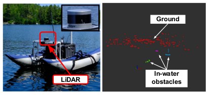
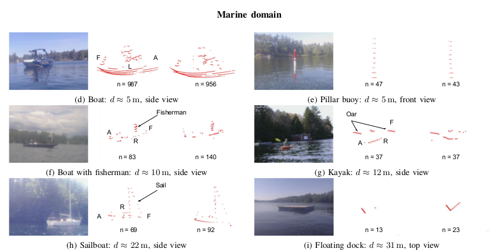

# ASV Detection Data
This repo conatins
* sample scenes of LiDAR dataset collected by Catabot in Dartmouth Robobotics lab.
* The format includes .pcd format files of raw point clouds and representative labelled point cloud used by https://github.com/Hitachi-Automotive-And-Industry-Lab/semantic-segmentation-editor
* The collected data covers fresh/salt waters and different objects in the maritime domain.

    * Catabot ASV in Dartmouth Robotics and clustered point cloud

    


## Author information
* Mingi Jeong (mingi.jrong.gr@dartmouth.edu)
* Alberto Quattrini Li (Alberto.Quattrini.Li@dartmouth.edu)


## Data link
https://drive.google.com/drive/folders/12MDV-0QykcS9L6GD3LBeCWKVJX6uvomv?usp=sharing

* Examples of point clouds in maritime domain

    


## Ongoing works
* We are working on making dataset inclusive of other sensors such as IMU, GPS, LiDAR, and camera image for situational awareness in the maritime domain.


## Citation
```
@INPROCEEDINGS{9636028,
  author={Jeong, Mingi and Li, Alberto Quattrini},
  booktitle={2021 IEEE/RSJ International Conference on Intelligent Robots and Systems (IROS)}, 
  title={Efficient LiDAR-based In-water Obstacle Detection and Segmentation by Autonomous Surface Vehicles in Aquatic Environments}, 
  year={2021},
  volume={},
  number={},
  pages={5387-5394},
  doi={10.1109/IROS51168.2021.9636028}}
```